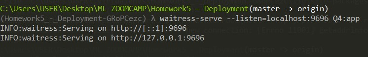
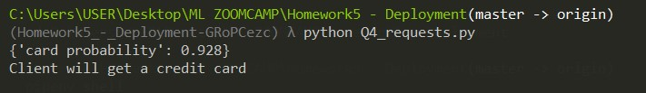
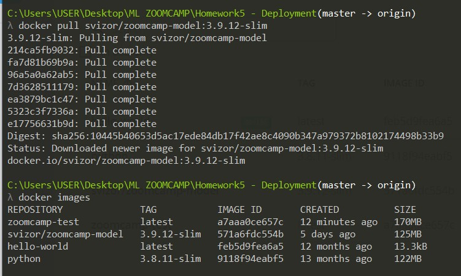
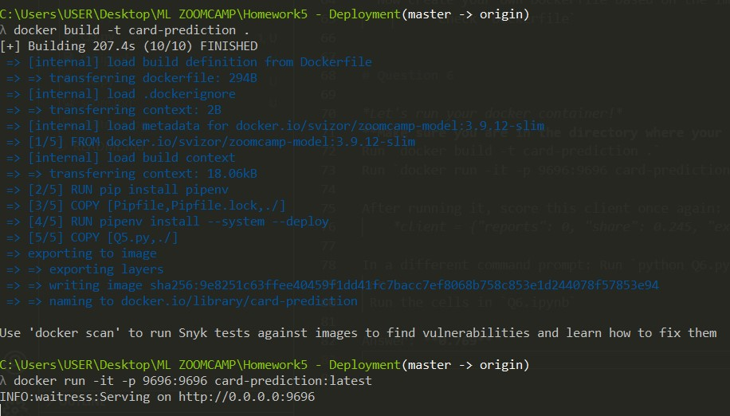
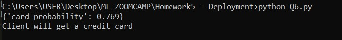

# Question 1

* Install Pipenv
* What's the version of pipenv you installed?
* Use --version to find out

Run `pipenv --version`
* Answer: **pipenv, version 2022.9.24**

# Question 2

* Use Pipenv to install Scikit-Learn version 1.0.2
* What's the first hash for scikit-learn you get in Pipfile.lock?

Run `pipenv install scikit-learn == 1.0.2`

* Answer: first hash **"sha256:08ef968f6b72033c16c479c966bf37ccd49b06ea91b765e1cc27afefe723920b"**

# Question 3

* We've prepared a dictionary vectorizer and a model.
*Let's use these models!*

    * Write a script for loading these models with pickle
    *Score this client:

        *{"reports": 0, "share": 0.001694, "expenditure": 0.12, "owner": "yes"}*

Run `python Q3.py` in any command line
* Answer: **0.162**

# Question 4

* Now let's serve this model as a web service

    * Install Flask and gunicorn (or waitress, if you're on Windows)
    * Write Flask code for serving the model
    * Now score this client using requests *[client = {"reports": 0, "share": 0.245, "expenditure": 3.438, "owner": "yes"}]*

**Using cmder or command prompt**

* Run `pipenv install flask, waitress`
* Run `pipenv shell` to activate environment
* Run `python Q4.py` which contains the Flask script
* Run  
* Run `python Q4_requests.py`

* Answer: **0.928**

# Question 5

* Download the base image svizor/zoomcamp-model:3.9.12-slim. You can easily make it by using docker pull command.
    * So what's the size of this base image?
    Run `docker images` 
    Check the SIZE column
        * Answer: **125MB**
        

## Dockerfile

* Now create your own Dockerfile based on the image we prepared.

    * Check `Dockerfile`

# Question 6

*Let's run your docker container!*
**Make sure you are in the directory where your Dockerfile is**
* Run `docker build -t card-prediction .`

* Run `docker run -it -p 9696:9696 card-prediction:latest`

After running it, score this client once again:
    *client = {"reports": 0, "share": 0.245, "expenditure": 3.438, "owner": "yes"}*

* In a different command prompt: Run `python Q6.py`
   or 
 * Run the cells in `Q6.ipynb`

* Answer: **0.769**

