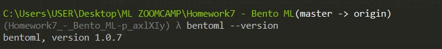
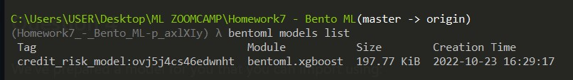
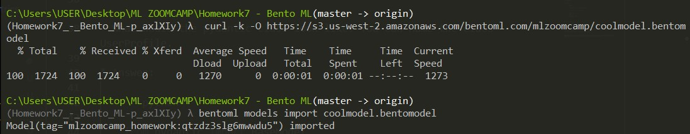
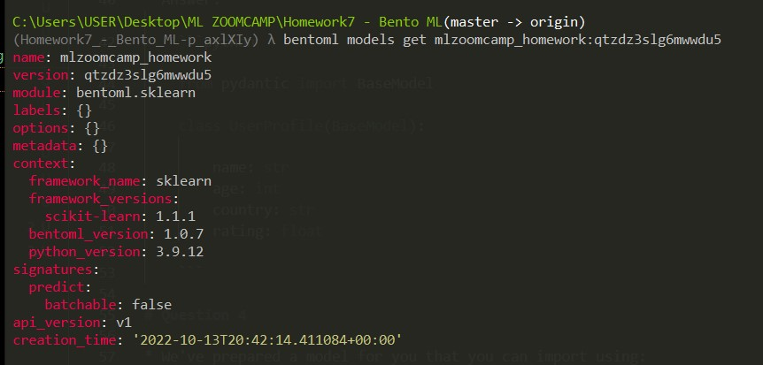
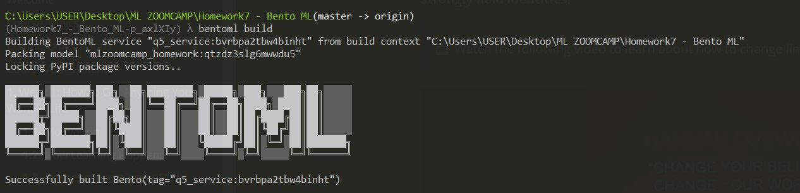
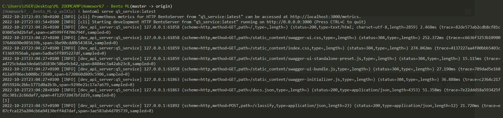
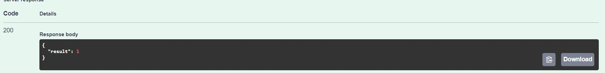
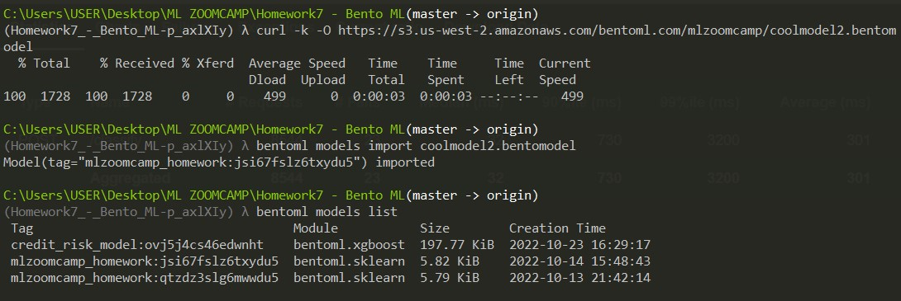

# Question 1

* Install BentoML
* What's the version of BentoML you installed?
* Use --version to find out

Run `bentoml --version`
* Answer: **1.0.7**

    

# Question 2

* Run the notebook which contains the xgboost model from module 6 i.e previous module and save the xgboost model with BentoML. 
* To make it easier for you we have prepared this [notebook](notebook.ipynb).

* How big approximately is the saved BentoML model? Size can slightly vary depending on your local development environment. 
* Choose the size closest to your model.

Run `bentoml models list`
* Answer: **197.77 KiB**

    

# Question 3

* Say you have the following data that you're sending to your service:

```python
{
  "name": "Tim",
  "age": 37,
  "country": "US",
  "rating": 3.14
}
```

* What would the pydantic class look like? You can name the class UserProfile.

* Answer:  

    ```python

    from pydantic import BaseModel

    class UserProfile(BaseModel): 

        name: str
        age: int
        country: str
        rating: float

    ```

# Question 4

* We've prepared a model for you that you can import using:

```

curl -k -O https://s3.us-west-2.amazonaws.com/bentoml.com/mlzoomcamp/coolmodel.bentomodel
bentoml models import coolmodel.bentomodel
```


* What version of scikit-learn was this model trained with?
* Answer: **1.1.1**

    


# Question 5

* Create a bento out of this scikit-learn model. 
* The output type for this endpoint should be NumpyNdarray()
* Send this array to the Bento:

    `[[6.4,3.5,4.5,1.2]]`

* You can use curl or the Swagger UI. What value does it return?

**Answer - STEPS**
* First, create a service.py - in this case, [Q5.py](Q5.py)
* Then create a bentofile.yamal - check [bentofile.yaml](bentofile.yaml)
* Then Run `bentoml build` in any command line in the directory of your `bentofile.yaml`

    

* Then serve the bento using :
    ```
    bentoml serve q5_service:latest
    ```
    

* Copy the link where it is hosting out and paste in a browser to use the Swagger UI

    
* Answer: **1**


# Question 6

* Ensure to serve your bento with `--production` for this question
* Install locust using:

    `pip install locust`

* Use the following locust file: [locustfile.py](locustfile.py)

* Ensure that it is pointed at your bento's endpoint (In case you didn't name your endpoint "classify")

* Configure 100 users with ramp time of 10 users per second. * Click "Start Swarming" and ensure that it is working.

Now download a second model with this command:

``` 
curl -O https://s3.us-west-2.amazonaws.com/bentoml.com/mlzoomcamp/coolmodel2.bentomodel

bentoml models import coolmodel2.bentomodel
```
* Update your bento's runner tag and test with both models. * Which model allows more traffic (more throughput) as you ramp up the traffic?


**Answer - STEPS**



| Models      | Max Users   |       RPS   |      Failure %   |
| ----------- | ----------- | ----------- | -----------|
| Model 1     | 100         | 94.8        | 0      |
| Model 1     | 500         | 126.3       | 0.8      |
| Model 1     | 750         | 111.1       | 1       |
**
| Model 2     | 100         | 91.8      | 0       |
| Model 2     | 500         | 153.4        | 0.5        |
| Model 2     | 750         | 147.2        | 1.2       |

* Best Model - **Model 2**