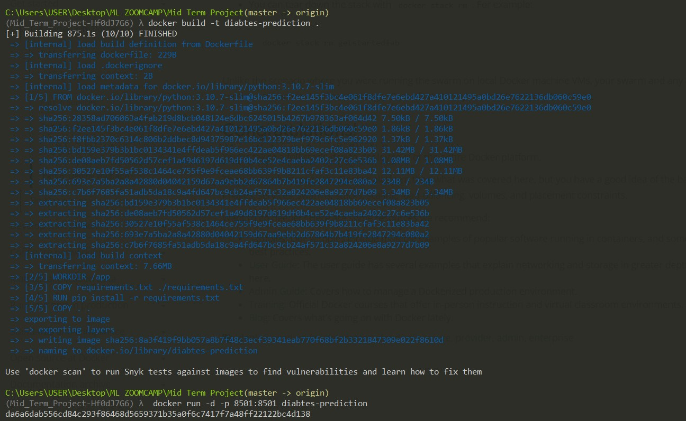

# Diabetes Risk Prediction using Machine Learning

## **Abstract**
Diabetes Mellitus is among acute diseases, and lots of people are suffering from this disease. According to the International Diabetes Federation, 382 million people live with Diabetes worldwide. By 2035, the number of people living with Diabetes will be 592 million. Diabetes is a disease caused due to an increased level of blood glucose. This high blood glucose produces the symptoms of frequent urination, increased thirst, and increased hunger. Diabetes is one of the leading causes of blindness, kidney failure, amputations, heart failure and stroke. When we eat, our body turns food into sugars or glucose. At that point, our pancreas is supposed to release insulin. Insulin is key to opening our cells, allowing the glucose to enter and will enable us to use the glucose for energy. But with Diabetes, this system does not work.

Type 1 and Type 2 diabetes are the most common forms of the disease, but there are also other kinds, such as gestational Diabetes, which occurs during pregnancy and other conditions. Machine learning is an emerging scientific field in data science dealing with how machines learn from experience. This project aims to develop a system which can perform early prediction of Diabetes for a patient with higher accuracy by combining the results of different machine learning techniques. More than five classification algorithms, such as Logistic Regression, Decision Trees, etc., were used to find the best model. The metric used to select the best model was the ROC AUC score.

## **About Data**

 The data used was gotten from [Kaggle](https://www.kaggle.com/datasets/alexteboul/diabetes-health-indicators-dataset?select=diabetes_binary_5050split_health_indicators_BRFSS2015.csv). The csv file used is a clean dataset of 70,692 survey responses to the CDC's BRFSS2015. It has an equal 50-50 split of respondents with no diabetes and with either prediabetes or diabetes. The target variable Diabetes_binary has 2 classes. 0 is for no diabetes, and 1 is for prediabetes or diabetes. This dataset has 21 feature variables and is balanced.

 ### **Features Description**
 * Diabetes_binary - 2 classes. 0 is for no diabetes, and 1 is for prediabetes or diabetes.
 * HighBP - 0 = no high BP ,1 = high BP
 * HighChol - 0 = no high cholesterol ,1 = high cholesterol
 * CholCheck -0 = no cholesterol check in 5 years ,1 = yes cholesterol check in 5 years
 * BMI - Body Mass Index
 * Smoker - Have you smoked at least 100 cigarettes in your entire life? [Note: 5 packs = 100 cigarettes] 0 = no ,1 = yes
 * Stroke - (Ever told) you had a stroke. 0 = no ,1 = yes
 * HeartDiseaseorAttack - coronary heart disease (CHD) or myocardial infarction (MI) 0 = no ,1 = yes
* PhysActivity - physical activity in past 30 days - not including job 0 = no ,1 = yes
* Fruits - Consume Fruit 1 or more times per day 0 = no 1 = yes
* Veggies - Consume Vegetables 1 or more times per day 0 = no ,1 = yes
* HvyAlcoholConsumption - (adult men >=14 drinks per week and adult women>=7 drinks per week) 0 = no ,1 = yes
* AnyHealthcare - Have any kind of health care coverage, including health insurance, prepaid plans such as HMO, etc. 0 = no ,1 = yes
* NoDocbcCost - Was there a time in the past 12 months when you needed to see a doctor but could not because of cost? 0 = no ,1 = yes
* GenHlth - Would you say that in general your health is: scale 1-5 1 = excellent 2 = very good 3 = good 4 = fair 5 = poor
* MentHlth - days of poor mental health scale 1-30 days
* PhysHlth - physical illness or injury days in past 30 days scale 1-30
* DiffWalk - Do you have serious difficulty walking or climbing stairs? 0 = no 1 = yes
* Sex - 0 = female 1 = male
* Age - 13-level age category (_AGEG5YR see codebook) 1 = 18-24 9 = 60-64 13 = 80 or older
* Education - Education level (EDUCA see codebook) scale 1-6 1 = Never attended school or only kindergarten 2 = elementary etc.
* Income - Income scale (INCOME2 see codebook) scale 1-8 1 = less than $10,000 5 = less than $35,000 8 = $75,000 or more

## Methodology 

* Data Wrangling
* EDA
* Features Selection
* Model Selection
* Model Deployment

The first four steps were carried out in [Analysis](Analysis.ipynb)

The model was deployed using **streamlit** in a **docker container**. 

* Check [app.py](app.py) and [Dockerfile](Dockerfile)

## Deployed Streamlit Container App 

<iframe width="560" height="315" src="https://www.youtube.com/embed/ppc7TC0dhk0" title="YouTube video player" frameborder="0" allow="accelerometer; autoplay; clipboard-write; encrypted-media; gyroscope; picture-in-picture" allowfullscreen></iframe>

## How to Create something similar.

* Fork the repo
* Start the Docker Desktop
* In a command line and in the directory of your repo,
    * Run `docker build -t diabetes-prediction . `
    * Run `docker run -d -p 8501:8501 diabetes-prediction`
*Check your Docker Desktop for the new container just created.
* Open the Container and click on the **Open in Browser** icon at the top of the resulting page. 
